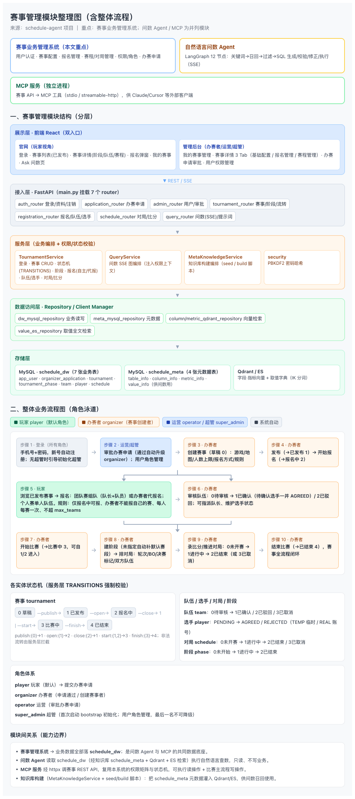
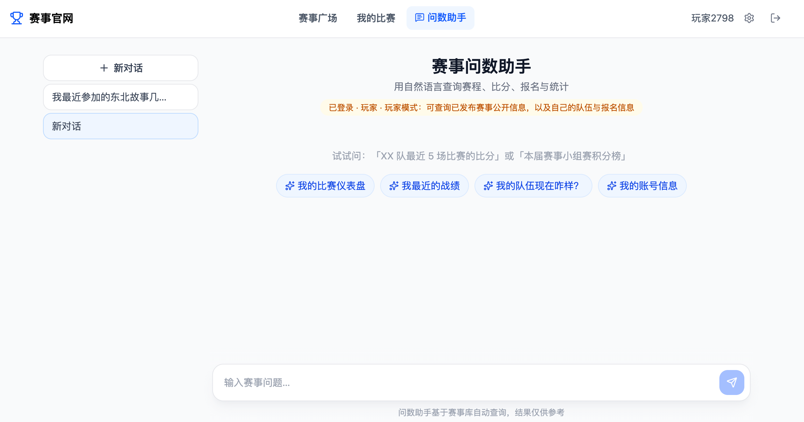
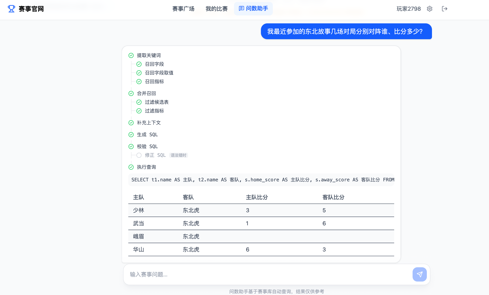
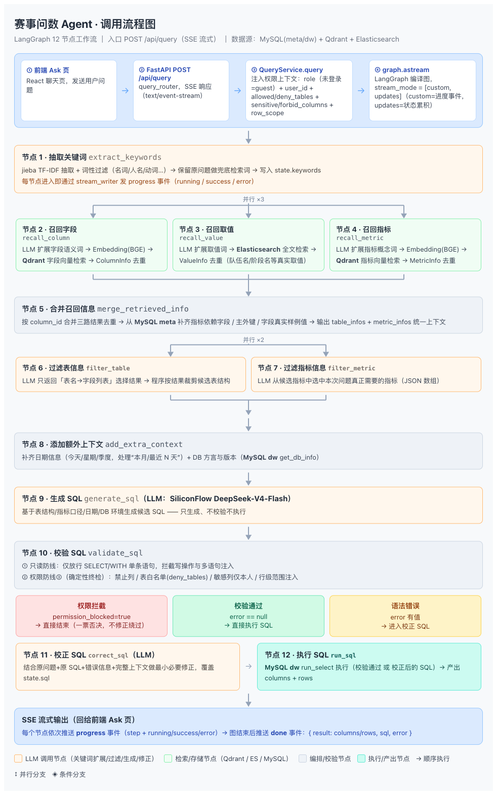
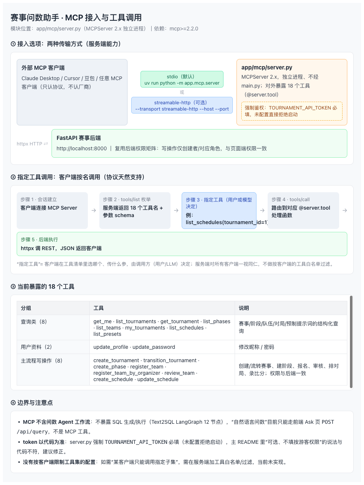
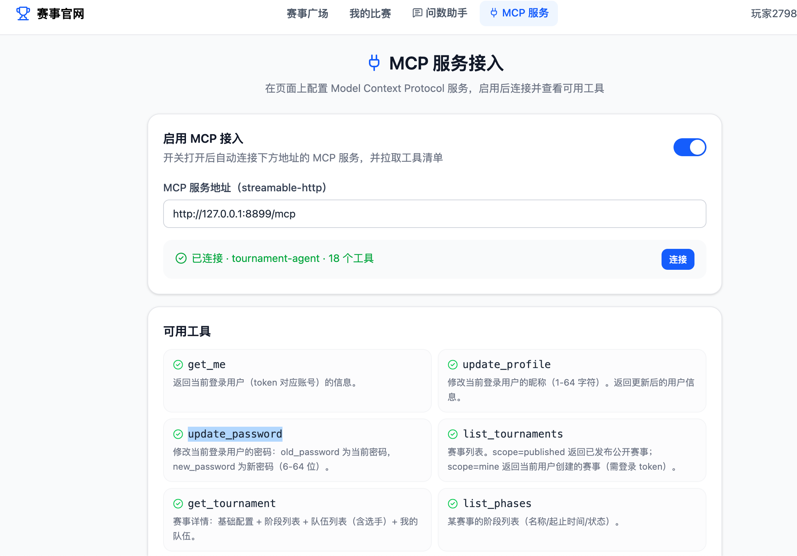

# 赛事管理 Agent（Tournament Agent）

一个三模块项目：**赛事业务管理系统**（用户认证、赛事配置、报名、赛程/对局管理）+ **自然语言问数 Agent**（LangGraph 工作流自动生成并执行 SQL，SSE 流式展示步骤与结果表格）+ **MCP 服务**（独立模块，把赛事 API 封装为 MCP 工具供外部 MCP 客户端调用，与 Agent 功能相互独立，见「MCP 服务（独立模块）」）。

## 功能总览

| 模块 | 能力 |
|---|---|
| 用户认证 | 手机号 + 密码登录（新用户自动注册）、无状态 Token、PBKDF2 密码哈希；4 种角色（玩家/办赛者/运营/超管），超管首次启动引导创建 |
| 权限管理 | 后台用户权限管理（仅超管）：分页用户列表、一键调整角色；最后一名超管不可降级 |
| 赛事管理 | 赛事 CRUD、基础配置（游戏/地图/人数上限/报名方式/规则）、状态流转（草稿→已发布→报名中→比赛中→已结束） |
| 阶段管理 | 赛事阶段（名称/起止时间/状态）维护 |
| 报名管理 | 队伍 + 选手管理；选手自主报名 / 办赛者代报名；队伍审核、队长指派、选手状态（AGREED/PENDING/REJECTED） |
| 赛程管理 | 对局编排（阶段/轮次/BO/决赛标记）、比分录入、对局状态流转 |
| 问数 Agent | 自然语言查询赛事数据，LangGraph 12 节点工作流：关键词抽取 → 三路并行召回 → 双路过滤 → SQL 生成/校验/修正/执行，SSE 实时推送执行步骤；不强制登录，按登录态+角色做权限查询（三层防线） |
| MCP 服务 | 独立模块、独立进程：将赛事业务 API 封装为 MCP 工具（MCPServer 2.x，stdio / streamable-http），供外部 MCP 客户端（Claude Desktop / Cursor 等）调用；复用后端权限矩阵，只读查询 + 比赛主流程写操作，**不含问数 Agent 工作流** |
| 预制提示词 | 按登录态+角色服务端过滤，每种角色默认 4 条；办赛者含「选择赛事」参数化提示词 |
| 前端 | 双入口：官网（玩家视角）+ 管理后台（办赛者/运营/超管视角），React 聊天式问数页 |

## 技术栈

| 层 | 技术 |
|---|---|
| 前端 | React 19 + Vite 8 + TypeScript + TailwindCSS v4 + react-router-dom 7 + lucide-react |
| 后端 | FastAPI + LangGraph + langchain |
| 数据访问 | SQLAlchemy 2.0 (async, asyncmy) |
| 业务库 | MySQL 8.0（`schedule_dw`：7 张业务表） |
| 知识库 | MySQL（`schedule_meta`：4 张元数据表）+ Qdrant（字段/指标向量）+ Elasticsearch 8.17 + IK 中文分词（取值字典） |
| LLM | SiliconFlow：DeepSeek-V4-Flash（SQL 生成）+ BAAI/bge-large-zh-v1.5（Embedding） |
| MCP | mcp>=2.2.0（MCPServer 2.x，stdio / streamable-http）+ httpx（调后端 REST） |
| 安全 | HMAC-SHA256 无状态 Token + PBKDF2-HMAC-SHA256 密码哈希（600,000 迭代） |
| 配置 | OmegaConf + python-dotenv + loguru + jieba |

## 系统架构



```
┌───────────────────────── 前端 (React) ─────────────────────────┐
│  官网（玩家）：赛事列表/详情/报名/我的赛事/Ask 问数             │
│  管理后台（办赛者）：赛事管理/基础配置/报名管理/赛程管理        │
└──────────────┬──────────────────────────────┬──────────────────┘
               │ REST（业务接口）              │ POST /api/query (SSE)
               ▼                              ▼
┌───────────────────────── 后端 (FastAPI) ───────────────────────┐
│  auth_router / tournament_router / registration_router          │
│  schedule_router                               query_router     │
│       │                                            │            │
│  TournamentService（业务编排）                QueryService（图编排）│
│  权限校验/状态机/报名规则                       LangGraph 12 节点 │
│       │                                            │            │
└───────┼────────────────────────────────────────────┼────────────┘
        ▼                                            ▼
┌────────────────────────────────────────────────────────────────┐
│ Repository 层                                                  │
│  MySQL(schedule_dw 业务)  MySQL(schedule_meta 元数据)           │
│  Qdrant(字段/指标向量)  Elasticsearch(取值字典)                 │
└────────────────────────────────────────────────────────────────┘

┌───────────────────── MCP 服务（独立模块 / 独立进程）─────────────────────┐
│  外部 MCP 客户端（Claude Desktop / Cursor / ...）                       │
│      ⇄ stdio / streamable-http ⇄ app/mcp/server.py（MCPServer 2.x）    │
│      ⇄ httpx HTTP ⇄ 后端 REST http://localhost:8000（复用权限矩阵）     │
│  不依赖 LangGraph / LLM / 知识库，不含问数 Agent 工作流                  │
└───────────────────────────────────────────────────────────────────────────┘
```

## 数据模型

### 业务库 schedule_dw（7 张表）

```
app_user（用户） ──1:N── tournament（赛事） ──1:N── tournament_phase（阶段）
                                │
                                ├─1:N── team（队伍） ──1:N── player（选手，user_id→app_user）
                                └─1:N── schedule（对局，home/away_team_id→team）
```

| 表 | 说明 | 关键状态枚举 |
|---|---|---|
| `app_user` | 登录用户/主办方（id=1 为系统虚拟用户）；`deleted_at` 非空表示已注销，昵称匿名化为「已注销用户{id}」，历史赛事/报名数据保留 | — |
| `organizer_application` | 办赛申请：申请人+原因+状态（PENDING/APPROVED/REJECTED），审批人/时间落库 | status：PENDING / APPROVED / REJECTED |
| `tournament` | 赛事主表：名称/游戏/地图/人数上限/报名方式/规则 | status：0草稿 1已发布 2报名中 3比赛中 4已结束 |
| `tournament_phase` | 赛事阶段（仅存名称/时间/状态） | status：0未开始 1进行中 2已结束 |
| `team` | 报名队伍 | status：0待审核 1已确认 2已驳回 3已取消 |
| `player` | 选手（TEMP 临时选手 user_id 可空） | status：AGREED / PENDING / REJECTED |
| `schedule` | 对局/赛程（BO 总比分） | status：0未开赛 1进行中 2已结束 3已取消 |

赛事状态流转：`publish(0→1) → open(1→2) → close(2→1) / start(1|2→3) → finish(3→4)`，非法流转由服务层拦截。

### 知识库 schedule_meta（4 张表，供问数 Agent 用）

`table_info`（表元数据）/ `column_info`（字段元数据，含别名/示例值）/ `metric_info`（指标）/ `value_info`（字段取值字典）

完整字段设计见 `docs/table-design.md`（V4 定稿）。

## 认证与安全

- **登录**：`POST /api/auth/login`（手机号 + 密码）。新手机号自动注册（昵称默认 `玩家{尾号4位}`）；历史无密码用户首次登录自动设置密码完成认领；密码错误统一返回"手机号或密码错误"，不泄露账号存在性。
- **Token**：HMAC-SHA256 签名的无状态 Token（`base64url(payload).base64url(signature)`，payload 为 `{uid, exp}`），默认有效期 7 天，密钥来自 `TOKEN_SECRET`。
- **密码哈希**：标准库 PBKDF2-HMAC-SHA256（600,000 迭代，随机盐），未引入 bcrypt/passlib（Python 3.14 兼容性考虑）。
- **角色体系**：`player`（玩家，默认）/ `organizer`（办赛者）/ `operator`（运营）/ `super_admin`（超管）。首次启动系统无超管时，服务日志会打印一次性 6 位初始化码，登录页出现「系统初始化」入口，凭初始化码创建超管（创建后通道关闭）；用户管理页（仅超管）可调整任意用户角色，最后一名超管不可降级。
- **办赛申请**：`player` 可提交办赛申请（申请人+申请原因），超管/运营在审批后台「通过/驳回」一键处理，通过后自动升级为 `organizer`；已有待审批申请时重复提交返回 409。
- **账号管理（所有登录用户）**：可修改昵称（`PATCH /api/auth/profile`）、修改密码（`PATCH /api/auth/password`，需校验旧密码）、注销账号（`DELETE /api/auth/account`，软注销：`deleted_at` 置位，历史数据保留，昵称匿名化；已注销账号不可登录，原 Token 立即失效）。
- **问数权限（三层防线）**：①召回层按角色裁剪候选表/字段；②SQL 生成/修正 Prompt 注入角色权限规则（可见表、行级范围、敏感列仅本人）；③`validate_sql` 确定性终检：禁看表一票否决、非超管表必须 ⊆ 白名单、敏感列（手机号/guid）必须带 `app_user.id = 当前用户`、已发布约束（`status >= 1`）、办赛者明细必须 `tournament.created_by = 当前用户`。权限错误不走 LLM 修正绕过，直接拒绝返回。

## API 一览

| 模块 | 方法 & 路径 | 说明 |
|---|---|---|
| Health | `GET /health` | 健康检查 |
| Auth | `POST /api/auth/login` | 手机号+密码登录（自动注册） |
| Auth | `GET /api/auth/me` | 当前用户信息（含 role） |
| Auth | `GET /api/auth/bootstrap/status` | 超管引导状态（need_bootstrap + 初始化码） |
| Auth | `POST /api/auth/bootstrap` | 凭初始化码创建系统超管（返回登录态） |
| Auth | `PATCH /api/auth/profile` | 修改昵称（所有登录用户） |
| Auth | `PATCH /api/auth/password` | 修改密码（校验旧密码） |
| Auth | `DELETE /api/auth/account` | 注销账号（软注销，置 deleted_at） |
| Apply | `POST /api/apply/organizer` | 玩家提交办赛申请（有 PENDING 时 409） |
| Apply | `GET /api/apply/status` | 我的办赛申请状态 |
| Admin | `GET /api/admin/users` | 用户分页列表（仅超管） |
| Admin | `PATCH /api/admin/users/{id}/role` | 调整用户角色（仅超管，保护最后一名超管） |
| Admin | `GET /api/admin/applications` | 办赛申请列表（超管/运营，可按 status 筛选分页） |
| Admin | `POST /api/admin/applications/{id}/review` | 审批办赛申请（`{"approve": true/false}`，通过自动升级 organizer，记录审批人） |
| Tournament | `GET/POST /api/tournaments` | 赛事列表（`scope=published\|mine`）/ 创建 |
| Tournament | `GET/PUT/DELETE /api/tournaments/{id}` | 赛事详情 / 更新 / 删除 |
| Tournament | `POST /api/tournaments/{id}/transition` | 赛事状态流转（publish/open/close/start/finish） |
| Tournament | `GET/POST /api/tournaments/{id}/phases` | 阶段列表 / 创建 |
| Tournament | `PUT/DELETE /api/tournaments/phases/{phase_id}` | 阶段更新 / 删除 |
| Registration | `GET /api/me/tournaments` | 我报名的赛事 |
| Registration | `GET/POST /api/tournaments/{id}/teams` | 队伍列表 / 自主报名 |
| Registration | `POST /api/tournaments/{id}/admin-teams` | 办赛者代报名 |
| Registration | `PATCH /api/teams/{id}/status`、`DELETE` | 队伍审核 / 删除 |
| Registration | `POST /api/teams/{id}/players` | 添加选手 |
| Registration | `PATCH /api/players/{id}/captain`、`/status`、`DELETE` | 队长指派 / 选手状态 / 删除 |
| Schedule | `GET/POST /api/tournaments/{id}/schedules` | 对局列表 / 创建 |
| Schedule | `PATCH/DELETE /api/schedules/{id}` | 对局更新（含比分）/ 删除 |
| Query | `POST /api/query` | Agent 问数（SSE 事件流，可选登录） |
| Query | `GET /api/query/presets` | 预制提示词（按登录态+角色过滤） |

## 前端页面

```
/login                          登录（手机号 + 密码；系统无超管时显示「系统初始化」入口）
官网（玩家视角）  /
  /                             赛事列表（已发布）
  /tournaments/:id              赛事详情（阶段/队伍/赛程，登录后显示报名入口）
  /register/:id                 报名链接直达（自动打开报名弹窗）
  /my                           我的赛事（需登录）
  /ask                          Ask 问数页（游客/登录均可；预制提示词按角色展示，SSE 流式展示执行步骤 + 结果表格）
管理后台（办赛者/运营/超管）  /admin
  /admin                        我的赛事管理列表
  /admin/tournaments/:id        赛事管理详情（基础配置 / 报名管理 / 赛程管理 三个 Tab）
  /admin/applications           办赛申请审批（超管/运营：通过/驳回，默认待审批筛选）
  /admin/users                  用户权限管理（仅超管：分页列表 + 角色调整）
```

Ask 问数页效果（首页预置提示词 + SSE 流式展示执行步骤 / 生成 SQL / 结果表格）：





## 目录结构

```
├── main.py                        # FastAPI 入口（挂载 7 个 router）
├── conf/
│   ├── app_config.yaml            # 全局配置（双库/Qdrant/ES/LLM/auth）
│   └── meta_config.yaml           # 知识库元数据配置（表/字段/指标/取值定义）
├── prompts/                       # LLM Prompt 模板（7 个：关键词扩展/过滤/SQL 生成/修正）
├── docker/                        # 基础设施
│   ├── docker-compose.yaml        # MySQL 8.0 / ES 8.17(IK) / Qdrant
│   ├── mysql/                     # init.sql + schema_meta.sql + schema_dw.sql
│   └── elasticsearch/Dockerfile   # 单节点 ES + IK 中文分词插件
├── docs/
│   ├── ag.md                      # LangGraph 工作流完整文档（12 节点）
│   ├── api-inventory.md           # 后端 API 完整清单（MCP 封装参考底稿）
│   ├── domain-overview.md         # 领域模型说明（接口样例 → 实体映射）
│   └── table-design.md            # 表结构设计（V4 定稿，含 ER 图）
├── app/
│   ├── conf/                      # 配置加载（app_config / meta_config）
│   ├── core/                      # 通用工具：idgen（雪花ID）/ security（Token）/ log
│   ├── clients/                   # 4 个客户端管理器（MySQL 管理 meta/dw 双连接 + Qdrant/ES/Embedding）
│   ├── entities/                  # 纯业务实体（User/Tournament/Team/Player/Schedule/...）
│   ├── models/                    # SQLAlchemy ORM 映射（meta + dw）
│   ├── repositories/              # Repository 层（meta/dw MySQL + Qdrant + ES + mappers）
│   ├── agent/
│   │   ├── llm.py                 # LLM 单例
│   │   ├── state.py / context.py  # State（业务数据） / Context（依赖注入）
│   │   ├── graph.py               # LangGraph 图定义（12 节点）
│   │   └── nodes/                 # 12 个图节点
│   ├── mcp/                       # MCP 服务（独立模块）：server.py（MCPServer 2.x 定义+入口）/ backend.py（后端 HTTP 客户端）
│   ├── services/                  # TournamentService（业务编排）/ QueryService（SSE 图编排）
│   │                              # MetaKnowledgeService（知识库构建编排）/ security（密码哈希）
│   ├── api/                       # lifespan / dependencies / schemas / 7 个 router
│   ├── prompt/                    # Prompt 加载器
│   └── scripts/                   # 脚本入口（seed / build）
└── frontend/                      # React 应用（官网 + 管理后台 + Ask）
```

## 问数 Agent 工作流（LangGraph，12 节点，对应 docs/ag.md）

```
START → extract_keywords
        ├─→ recall_column（Qdrant 字段向量）
        ├─→ recall_value（ES 取值字典全文）       三路并行
        └─→ recall_metric（Qdrant 指标向量）
              ↓
        merge_retrieved_info（按字段/表组织，补主外键与表描述）
        ├─→ filter_table（LLM 裁剪候选表与字段）  双路并行
        └─→ filter_metric（LLM 裁剪候选指标）
              ↓
        add_extra_context（日期 + 数据库信息）
              ↓
        generate_sql → validate_sql（只读正则防线 + EXPLAIN）
                        │ error 为空（校验通过）
                        ▼
                      run_sql → END（结果写回 state.result，SSE done 事件）
                        ▲
        correct_sql ←──┘ error 非空（修正后重入 run_sql）
```



## MCP 服务（独立模块，与 Agent 功能相互独立）

MCP 服务（`app/mcp/`）是一个**独立模块**，以**独立进程**运行（不经 `main.py` 挂载、不挂 FastAPI 路由），通过 stdio / streamable-http 对外提供 MCP 协议能力，把赛事业务 API 封装为 MCP 工具，供任何支持 MCP 的客户端（Claude Desktop / Cursor / 豆包等）调用。

**与问数 Agent 的区别：**

| 维度 | 问数 Agent | MCP 服务 |
|---|---|---|
| 本质 | 自然语言 → SQL 的 LangGraph 工作流（12 节点） | 赛事 API 的 MCP 协议适配层 |
| 运行方式 | FastAPI 进程内（`query_router` → `QueryService`） | 独立进程（`uv run python -m app.mcp.server`），不经 `main.py` |
| 调用入口 | 前端 Ask 页 `POST /api/query`（SSE 流式） | 外部 MCP 客户端 ⇄ stdio / streamable-http ⇄ 后端 REST |
| 能力 | 问数：关键词召回 → SQL 生成/校验/执行 | 结构化查询 + 比赛主流程写操作（复用后端权限矩阵） |
| 依赖 | LangGraph + LLM + 知识库（Qdrant / ES / meta） | 仅 httpx 调后端 REST，不依赖 LLM / 知识库 |

- **不包含、不暴露问数 Agent 工作流**：MCP 不提供 SQL 生成，不接 LLM 与知识库，二者能力边界完全分离；
- **复用后端权限矩阵**：未登录 = guest（仅公开数据）；通过环境变量 `TOURNAMENT_API_TOKEN` 注入登录 token 后按角色（player/organizer/operator/super_admin）访问，写操作权限与后端一致；
- **工具清单**：8 个只读工具（赛事/阶段/队伍/选手/对局/预制提示词查询）+ 8 个比赛主流程写工具（创建赛事/状态流转/创建阶段/报名/审核/对局），详见 `app/mcp/README.md`。





## 代码分层

```
scripts（入口/调度） → services（业务编排） → repositories（存储读写） → mappers（对象转换） → models（ORM）↔ 数据库
                                                          ↘ entities（业务实体，与 ORM 模型分离）
```

- `app/entities`：业务实体层，统一表示表、字段、指标和值（与 ORM 模型解耦）
- `app/models`：ORM 模型层，定义 meta / dw 库对应的 SQLAlchemy 模型
- `app/repositories`：存储访问层，负责与底层存储（MySQL/Qdrant/ES）打交道
- `app/services`：业务编排层（TournamentService / QueryService / MetaKnowledgeService）
- `app/scripts`：脚本入口层，只做参数解析与调度（seed / build）
- `app/conf`：程序内配置结构与配置加载（app_config.yaml / meta_config.yaml）
- `app/mcp`：MCP 协议层（**独立模块**），不参与上述分层，通过 httpx 调后端 REST API，独立进程启动

## 启动步骤

```bash
# 0. 准备环境变量
cp .env.example .env   # 填入 LLM_API_KEY（SiliconFlow），可选 TOKEN_SECRET（生产必填）

# 1. 基础设施（MySQL / ES / Qdrant）
cd docker && docker-compose up -d

# 2. 初始化业务库 + 灌入知识库元数据（首次或元数据变更后）
#    业务表 DDL 由 docker/mysql/schema_dw.sql 自动执行（docker-entrypoint-initdb.d）；
#    知识库侧：seed 命令在 conf/meta_config.yaml 缺失时自动基于 DW 表结构生成
#    （可手工修改表/字段/指标定义后再重跑），并按配置灌入 meta 元数据（整表替换，幂等）；
#    最后构建 Qdrant/ES 索引（构建前自动清空旧索引，保证与 meta 库一致）：
cd .. && uv run python -m app.scripts.seed_meta_knowledge          # 生成配置（如缺失）+ 按配置灌 meta（DW → meta）
uv run python -m app.scripts.build_meta_knowledge                  # 构建 Qdrant/ES 索引

# 3. 启动后端
uv run uvicorn main:app --reload      # http://localhost:8000  （/health、/api/*）

# 4. 启动前端
cd frontend && pnpm dev                # http://localhost:5173
# 可选：如需跨域/联调，设置 VITE_API_BASE_URL（如 http://localhost:8000）

# 5. 启动 MCP 服务（可选，独立模块/独立进程，供外部 MCP 客户端接入；需后端已启动）
cd .. && uv run python -m app.mcp.server        # 默认 stdio 传输
# 可选：streamable-http 模式
uv run python -m app.mcp.server --transport streamable-http --host 127.0.0.1 --port 8899
# 环境变量（根 .env）：TOURNAMENT_API_BASE 后端地址；TOURNAMENT_API_TOKEN 预置登录 token（可选，不填按游客权限）
```

## 文档索引

| 文档 | 内容 |
|---|---|
| `docs/ag.md` | LangGraph 问数工作流完整说明（图定义、12 节点职责、状态流转、运行配置） |
| `docs/domain-overview.md` | 领域模型说明（接口样例 → 实体映射、敏感信息脱敏约定） |
| `docs/table-design.md` | 表结构设计 V4（字段明细、ER 图、状态枚举、最小流程流转） |
| `docs/api-inventory.md` | 后端 API 完整清单（MCP 封装参考底稿） |
| `app/mcp/README.md` | MCP 服务独立文档（快速开始 / 工具清单 / 客户端接入配置 / 与后端 API 对应关系） |
