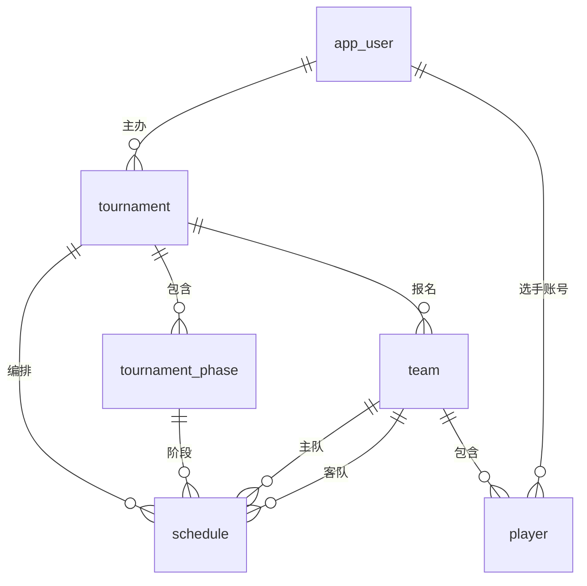

# 赛事管理 Agent — 表结构设计（V4 已定稿）

> 依据：`mdocs/` 下 7 张后台截图 + 8 个接口 JSON 样例。
> 原则：字段简化、保留完整工作流（用户 → 赛事配置 → 报名 → 赛程 → 对局 → 结果），最小流程可流转。
> 库划分：`schedule_meta`（知识库元数据） / `schedule_dw`（6 张业务表）。
> DDL 文件：`docker/mysql/schema_dw.sql`。

## 0. 已确认结论

| 项 | 结论 |
|---|---|
| 用户表名 | `app_user`（避免保留字） |
| 主键 | **全部自增 INT**（不再落库外部系统 ID，BIGINT→INT） |
| 奖励表 | **移除**（不建 tournament_reward） |
| 分组表 | **移除**（不建 tournament_group，team/schedule 无 group_id） |
| 头像/队徽 | **移除**（app_user.head_icon、team.avatar） |
| 游戏平台/奖池 | **移除**（game_cp、total_bonus、sponsor_bonus） |
| 联系方式/规则 | 字符串自由文本（contact_requirement VARCHAR、rule_info VARCHAR） |
| 游戏地图 | 字符串自由文本（game_maps VARCHAR） |
| 游戏模式 | **移除**（game_mode 不参与流转） |
| phase 表 | **简化**（仅保留 id/tournament_id/name/start_time/end_time/status，赛制配置不落库） |
| 个人赛 | 复用 team 表（单人队伍） |
| BO 多小场 | 不建子表，仅存总比分 |
| TEMP 选手 | user_id 可空，指向虚拟 user（id=1） |

## 1. 表清单总览

| # | 表名 | 中文 | 对应样例/截图 | 作用 |
|---|---|---|---|---|
| 1 | `app_user` | 用户 | user_current_info.json | 登录用户/主办方 |
| 2 | `tournament` | 赛事 | save_base_info.json / 截图1+2 | 赛事列表 + 基础配置 + 报名规则 |
| 3 | `tournament_phase` | 赛事阶段 | 截图5（阶段配置） | 赛制/晋级配置 |
| 4 | `team` | 队伍 | team_list.json | 报名管理 |
| 5 | `player` | 选手 | team_list.json.players | 选手管理 |
| 6 | `schedule` | 赛程/对局 | schedules.json / 截图6 | 比赛管理 + 对局管理 |

## 2. 字段明细（定稿）

### 2.1 app_user 用户

| 字段 | 类型 | 说明 |
|---|---|---|
| id | INT 自增 PK | 用户 ID（id=1 为系统虚拟用户占位） |
| guid | BIGINT | 平台 GUID（可空） |
| nickname | VARCHAR(64) | 昵称 |
| phone | VARCHAR(32) | 手机号 |
| created_at | DATETIME | 创建时间 |

### 2.2 tournament 赛事

| 字段 | 类型 | 说明 |
|---|---|---|
| id | INT 自增 PK | 赛事 ID |
| name | VARCHAR(128) | 赛事名称 |
| created_by | INT FK→app_user.id | 主办方用户 |
| game | VARCHAR(64) | 游戏项目 |
| game_maps | VARCHAR(2000) | 可选地图（自由文本） |
| team_mode | TINYINT | 1团队赛 2个人赛 |
| start_time / end_time | DATETIME | 赛事起止 |
| reg_start_time / reg_end_time | DATETIME | 报名起止 |
| max_team_members | INT | 队伍最大成员数 |
| max_teams | INT | 队伍数量上限 |
| regist_method | TINYINT | 1办赛者代报名 2选手自主报名 |
| contact_requirement | VARCHAR(255) | 联系方式要求（自由文本） |
| rule_info | VARCHAR(2000) | 比赛规则（自由文本） |
| status | TINYINT | 0草稿 1已发布 2报名中 3比赛中 4已结束 |
| created_at / updated_at | DATETIME | 时间戳 |

### 2.3 tournament_phase 赛事阶段（基础信息：名称/时间/状态）

| 字段 | 类型 | 说明（接口字段） |
|---|---|---|
| id | INT 自增 PK | 阶段 ID |
| tournament_id | INT FK→tournament.id | 所属赛事 |
| name | VARCHAR(32) | 阶段名称（phaseName） |
| start_time / end_time | DATETIME | 阶段起止（startTime/endTime） |
| status | TINYINT | 阶段状态（phaseStatus）0未开始 1进行中 2已结束 |

### 2.4 team 队伍

| 字段 | 类型 | 说明 |
|---|---|---|
| id | INT 自增 PK | 队伍 ID |
| tournament_id | INT FK→tournament.id | 报名的赛事 |
| name | VARCHAR(64) | 队伍名 |
| status | TINYINT | 0待审核 1已确认 2已驳回 3已取消 |
| created_at | DATETIME | 报名时间 |

### 2.5 player 选手

| 字段 | 类型 | 说明 |
|---|---|---|
| id | INT 自增 PK | 选手 ID |
| team_id | INT FK→team.id | 所属队伍 |
| user_id | INT FK→app_user.id | 平台用户（可空；TEMP 指虚拟 user id=1） |
| nickname | VARCHAR(64) | 昵称 |
| is_captain | TINYINT | 是否队长 |
| status | VARCHAR(16) | AGREED / PENDING / REJECTED |
| player_type | VARCHAR(16) | TEMP 临时 / REAL 正式 |
| created_at | DATETIME | 加入时间 |

### 2.6 schedule 赛程/对局

| 字段 | 类型 | 说明 |
|---|---|---|
| id | INT 自增 PK | 对局 ID |
| tournament_id | INT FK→tournament.id | 所属赛事 |
| phase_id | INT FK→tournament_phase.id | 所属阶段 |
| round | INT | 轮次序号 |
| round_name | VARCHAR(32) | 轮次名（总决赛） |
| bo | INT | BO 局数（1/3/5） |
| is_final | TINYINT | 是否决赛 |
| home_team_id | INT FK→team.id | 主队 |
| away_team_id | INT FK→team.id | 客队 |
| home_score / away_score | INT | 比分（未赛为 NULL） |
| status | TINYINT | 0未开赛 1进行中 2已结束 3已取消 |
| start_time | DATETIME | 开赛时间 |
| created_at / updated_at | DATETIME | 时间戳 |

## 3. 关联关系（ER）



```
app_user ──1:N── tournament ──1:N── tournament_phase
                            │
                            ├─1:N── team ──1:N── player
                            │
                            └─1:N── schedule ◄───── 主队/客队 ──N:1── team
```

### 3.1 ASCII 表关系（含外键明细）

```
══════════════════════════════════════════════════════════════════
   schedule_dw · 6 张表关系 · 最小流程数据链路
══════════════════════════════════════════════════════════════════

 ┌─────────────────────┐          ┌──────────────────────────────────┐
 │ app_user（用户）      │          │ tournament（赛事）                │
 │ id        PK         │          │ id         PK                   │
 │ guid                  │          │ name                            │
 │ nickname              │          │ created_by FK ────────────────┐  │
 │ phone                 │          │ game / game_maps              │  │
 │ created_at            │          │ team_mode                     │  │
 └──────────┬───────────┘          │ start_time / end_time         │  │
            │ 1:N 主办              │ reg_start_time / reg_end_time  │  │
            ▼                      │ max_team_members / max_teams   │  │
                                   │ regist_method                  │  │
                                   │ contact_requirement            │  │
                                   │ rule_info                      │  │
                                   │ status (0草稿…4已结束)          │  │
                                   │ created_at / updated_at        │  │
                                   └───┬───────────────┬────────────┘  │
            ┌──────────────────────────┘               │ 1:N          │
            │ 1:N                                     ▼              │
            │                             ┌───────────────────────┐   │
            │                             │ tournament_phase      │   │
            │                             │ id       PK           │   │
            │                             │ tournament_id FK──────┼───┘
            │                             │ name                  │
            │                             │ start_time/end_time   │
            │                             │ status (0/1/2)        │
            │                             └──────────┬────────────┘
            │                                        │ 1:N (phase_id)
            │                                        ▼
 ┌─────────────────────┐          ┌──────────────────────────────────┐
 │ team（队伍）          │          │ schedule（赛程/对局）             │
 │ id        PK         │          │ id          PK                  │
 │ tournament_id FK ────┼──┐       │ tournament_id FK ────────────┐  │
 │ name                 │  │       │ phase_id FK ──────────────┐  │  │
 │ status (0待审…3取消)  │  │       │ round / round_name        │  │  │
 │ created_at           │  │       │ bo / is_final             │  │  │
 └──────────┬───────────┘  │       │ home_team_id FK ────────┐ │  │  │
            │ 1:N          │       │ away_team_id FK ──────┐ │ │  │  │
            ▼              │       │ home_score/away_score │ │ │  │  │
 ┌─────────────────────┐   │       │ status (0未开赛…3取消) │ │ │  │  │
 │ player（选手）        │   │       │ start_time             │ │ │  │  │
 │ id        PK         │   │       │ created_at/updated_at │ │ │  │  │
 │ team_id FK ──────────┼───┘       └───────────────────────┴─┴─┴──┴──┘
 │ user_id FK ──► app_user (可空)      ▲           ▲           ▲
 │ nickname / is_captain               │           │           │
 │ status / player_type                │           │           └──► team.id
 │ created_at                          └───────────┴──► team.id
 └─────────────────────┘            (home_team_id)  (away_team_id)
```

**数据链路（最小流程）**

> 注：图中 id PK 均为 INT 自增主键，外键均为 INT，由应用层插入后由 DB 生成 ID。

```
① app_user ──创建──▶ tournament ──配置──▶ tournament_phase
② tournament ──报名──▶ team ──添加──▶ player（player.user_id → app_user）
③ tournament + phase ──编排──▶ schedule
   schedule.home_team_id / away_team_id → team
④ schedule 比分/状态 ──汇总──▶ tournament.status
```

## 4. 最小流程流转

```
① 登录        app_user 登录
② 创建赛事    tournament(status=0 草稿) ← created_by=app_user.id
③ 赛事配置    基础(②字段) + 阶段(tournament_phase) + 规则(rule_info)
④ 发布        tournament.status=2 报名中
⑤ 报名管理    team + player 报名 → 主办方确认/驳回(team.status) → 结束报名
⑥ 赛程编排    按阶段生成 schedule(status=0 未开赛, home/away 对阵)
⑦ 比赛管理    设置开赛时间(schedule.start_time) → 状态流转
⑧ 对局结果    录入比分(home_score/away_score) → status=2 已结束
⑨ 赛事结束    决赛结束 → tournament.status=4 已结束
```

## 5. 关键状态枚举

| 表.字段 | 取值 |
|---|---|
| tournament.status | 0草稿 1已发布 2报名中 3比赛中 4已结束 |
| phase.status | 0未开始 1进行中 2已结束 |
| team.status | 0待审核 1已确认 2已驳回 3已取消 |
| player.status | AGREED / PENDING / REJECTED |
| schedule.status | 0未开赛 1进行中 2已结束 3已取消 |

## 6. 说明

- `app_user.id=1` 为系统虚拟用户（TEMP 选手占位），保证 player.user_id 统计口径统一。
- 主键/外键全部为 INT 自增，ID 由 DB 生成，不再落库外部系统 ID。
- 所有 FK 均为逻辑关联（ORM 层维护），DDL 建物理外键便于联表，生产可选关闭。
- 平台名/游戏名/头像/队徽/奖品图片等敏感信息不入库，示例一律用脱敏占位。
